# Documentation for TradeApp

## Access

To access the TradeApp service, run UserService.java in a Java compiler. Then go to http://localhost:8080/. This website can only be accessed locally.

At the login page, the user can enter a pre-existing username and password, or create an account:
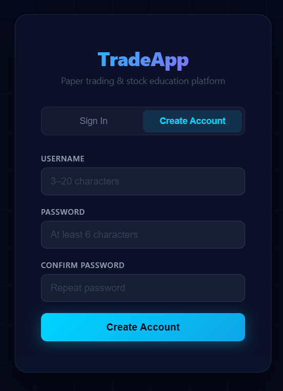

They must enter a username between 3-20 characters, with no special characters, as well as a secure password, to then access the site. The account created will start with **$10,000.**

For demonstrative purposes, all further screenshots will be taken from a pre-existing account.

## Homepage

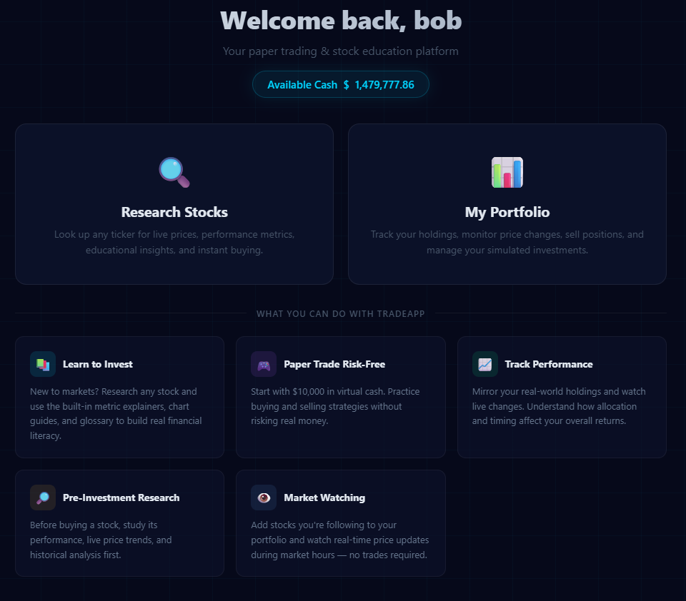

The homepage will display the user's total available cash, as well as menu options for the application's primary functions:

- Research Stocks
- Manage Portfolio

Additionally, the panels below the menu options list general features of TradeApp.

## Research Stocks

When researching stocks, the user must enter **the stock symbol,** or stock ticker, to research the stock - this limitation is unfortunately due to API handling. The API will not recognize any input that does not correspond to a valid stock ticker.

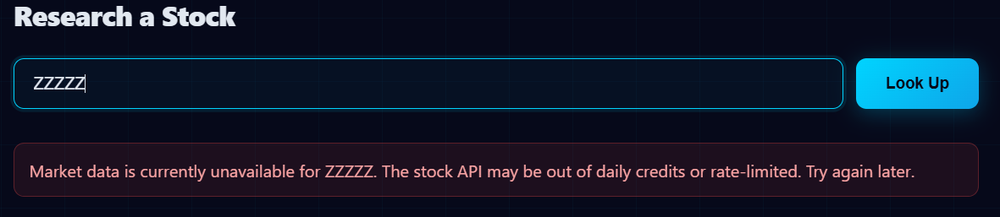

However, once the user does enter a valid ticker symbol, they will see:

- A graph displaying the stock's price trend across the past week, month, and year
- The stock's current latest available price
- The opening price, latest price, volume, and 1-day change
- The stock's price change across 1 week, 1 month, 3 months, 6 months, and year-to-date
- A brief analysis of the stock's performance, and what it means

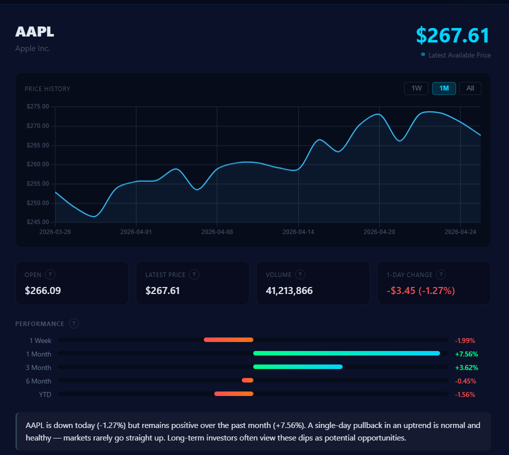

The user can also click on the question mark symbols in the opening price, latest price, volume, 1-day change, and performance boxes for explanations about the significance of those metrics. Below shows when you click the symbol in the volume box.

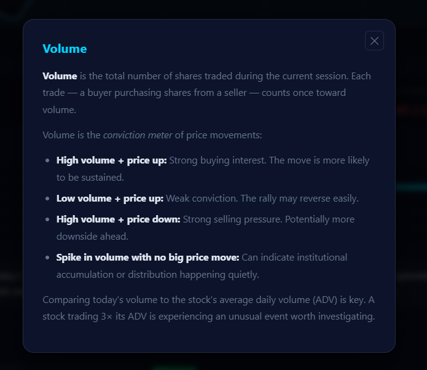

The user then has the option to buy the stock at the latest available price in either shares or dollars. An estimated cost based on the latest available price will appear. The example uses Apple (AAPL) stock.

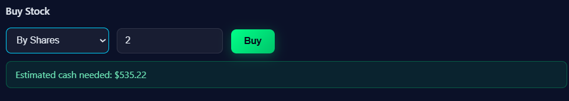

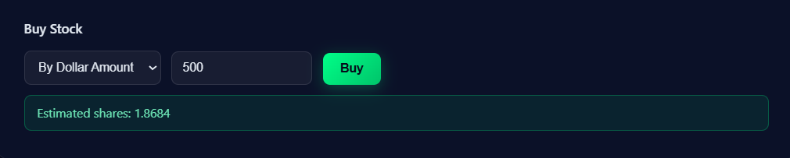

If the user chooses to purchase the stock, they will receive a confirmation of their purchase, and how much available cash remains in their account.

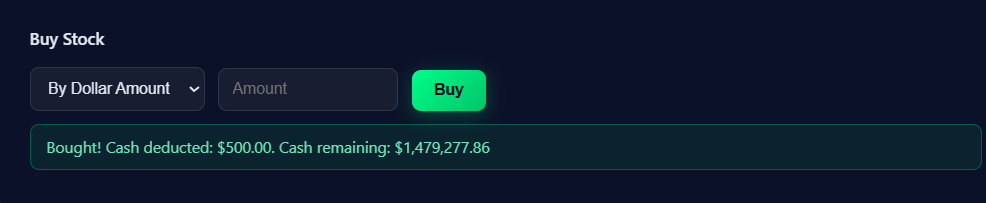

The user can also conduct further analysis, either before or after making the purchase, through what-if analysis: what if the user purchased X shares of the stock on a date in the past?

This analysis does not contribute anything to the actual portfolio's value, nor does it deduct any cash. It is purely a theoretical analysis that shows the change in price from a date in the past to today, adjusting for how many shares the user opted to by. The example uses Apple (AAPL) stock.

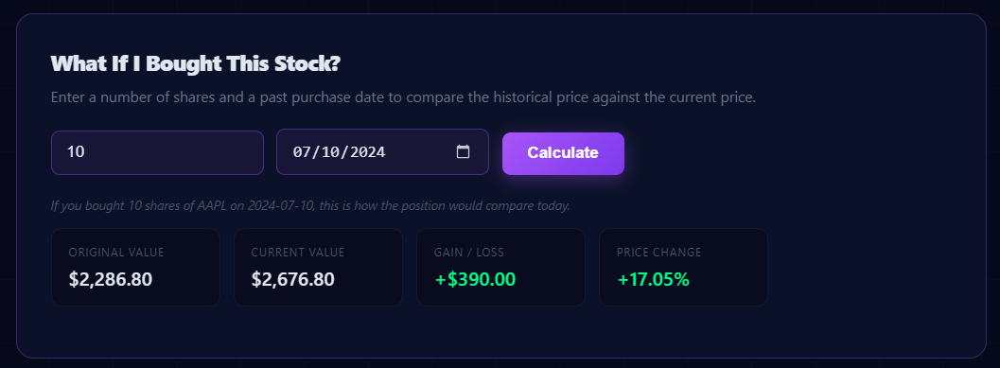

Below all the analysis are three menus containing valuable information for beginners:

- Metrics, which explains the significance of the metrics displayed throughout the TradeApp analysis - opening price, closing price, volume, 1-day change, performance periods
- How to read price charts, and what information can be taken away from them
- A glossary, which contains common definitions used throughout stock analysis and in the trading world

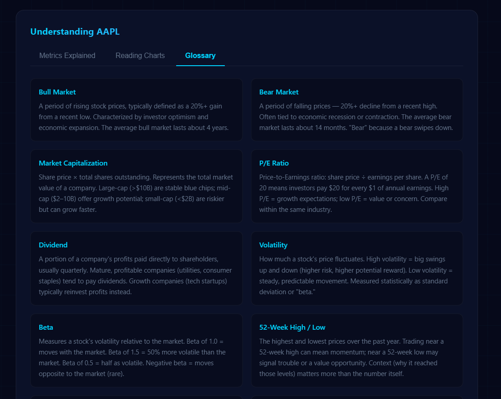

All the glossary definitions are unable to fit without severely ruining the image quality.

## Portfolio Management

The portfolio contains all of the investments a user has made throughout their time on the TradeApp platform, as well as the user's portfolio value, cash balance, and overall change in portfolio value. Each investment made is distinct, and is coded separately.

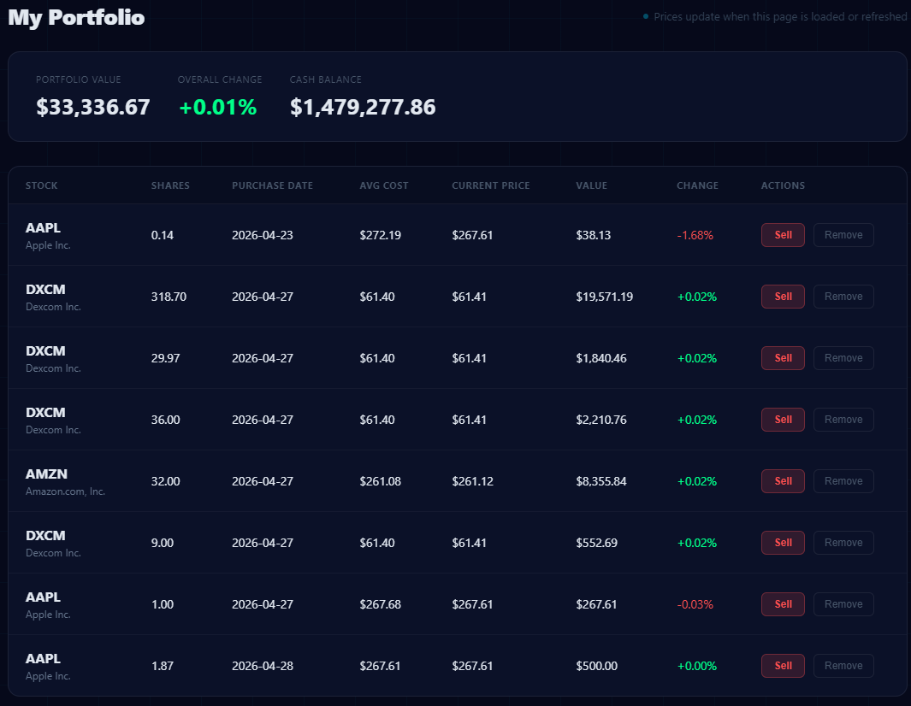

Users can then either sell their investments at a profit (or loss), or completely remove them from the portfolio without receiving the profits (or losses) from their investment.

When selling investments, users have three options:

- Sell by number of shares
- Sell by dollar amount
- Sell everything

As each investment made is distinct, the sale will only impact the investment selected for that line.

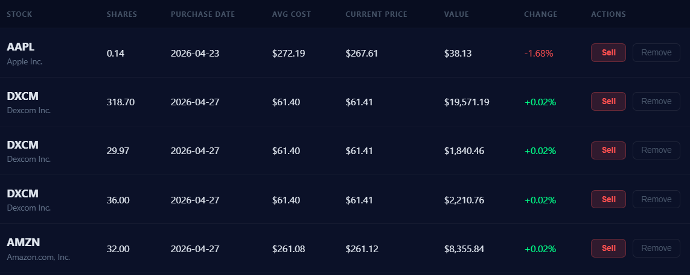

Say the user wants to sell 20 shares in their investment of 36 shares:

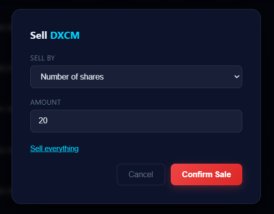

The portfolio value, overall change, and cash balance will be updated accordingly:

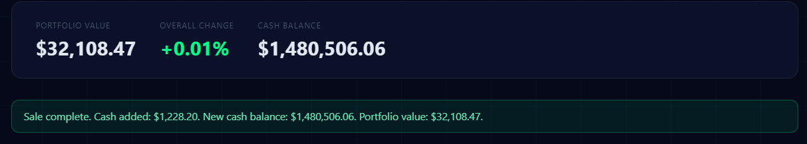

As will the change for that specific investment. The only investment impacted was the one made for 36 shares, which is now 16 shares.

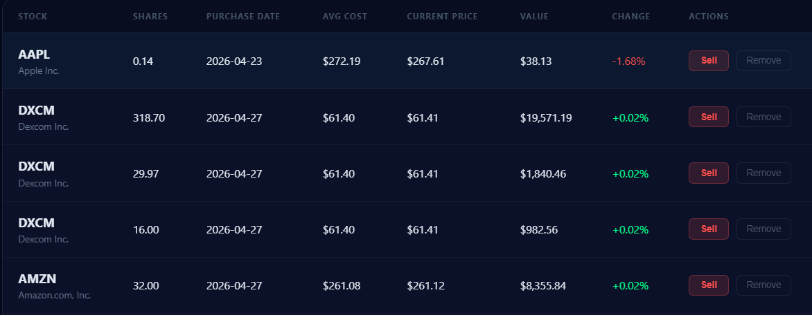

However, when removing an investment, the entire investment will be removed for that individual line. Meaning, if there have been two transactions made for a stock, but the user removes one, the other one will still remain.

This should only be used in rare cases based on user need.

Again: **profits or losses will not be received when removing an investment.**

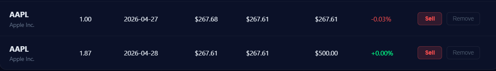

Say the user wants to remove their 1-share investment that was made accidentally:

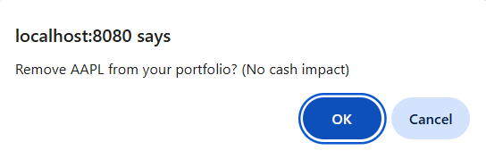

The portfolio value will change, but the cash balance will not:

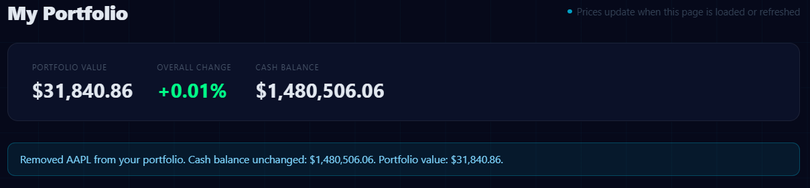

And the investment will no longer exist in the portfolio:

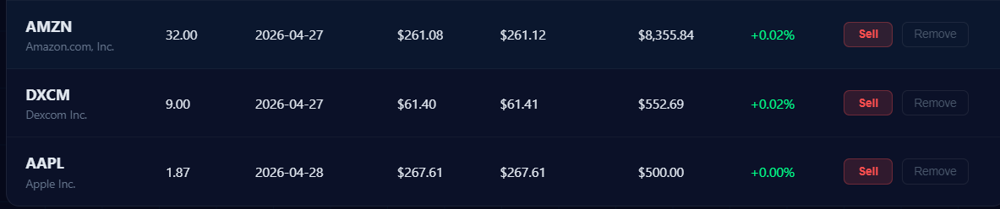

Once complete, the user may sign out. Their data will be saved.
