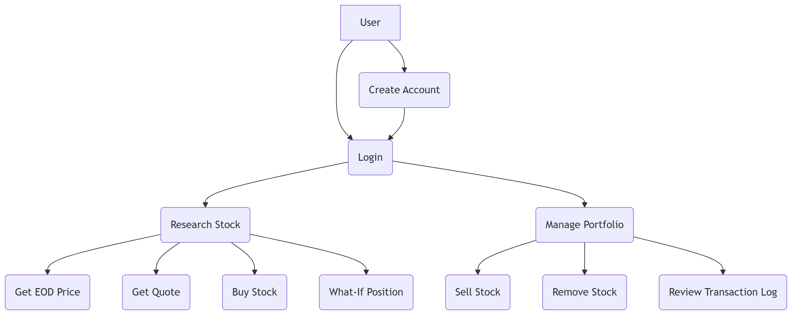
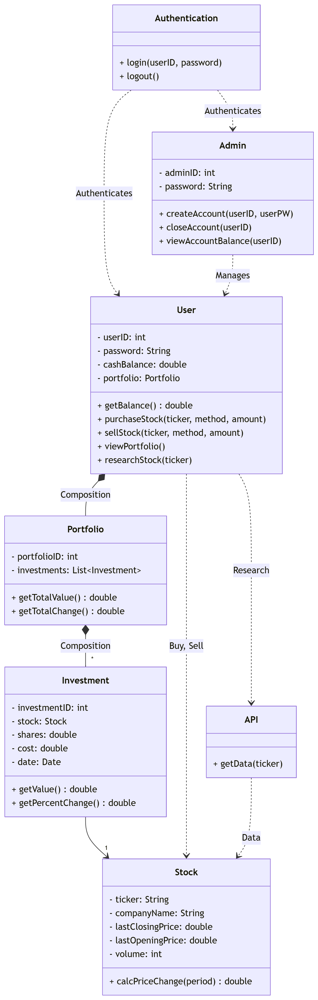
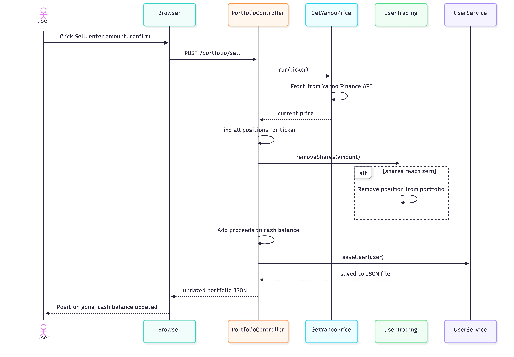
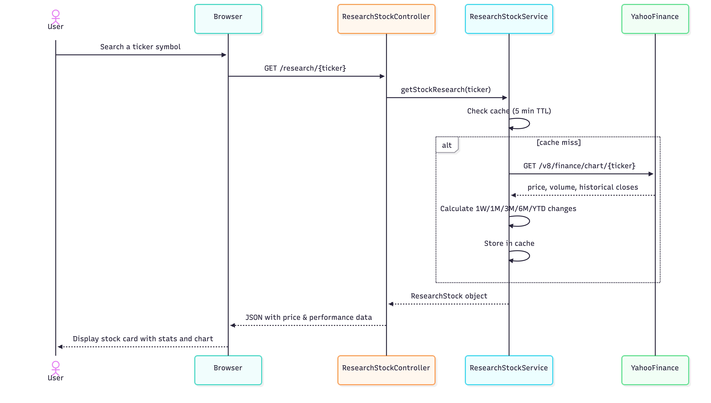
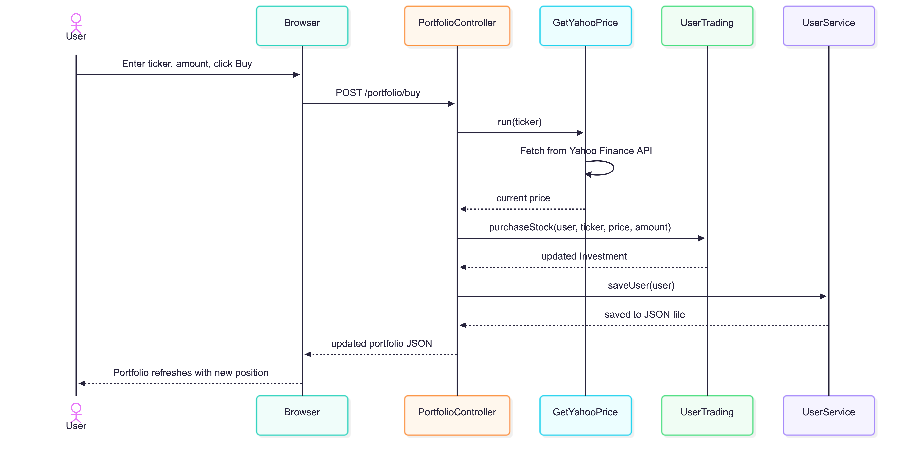

# COMP 345 Project 2.0 – Task Pitch

## Overview

This project is a **paper trading stock exchange platform** that allows users to practice trading stocks and ETFs using simulated money. The system uses the Twelve Data API to pull real-time stock data so users can research investments and manage a simulated portfolio.

For simplicity, the term **stock** is used throughout this document to refer to any investment.

---

## Core Features

### Stock Research
- Enter in a stock (including publicly-traded mutual funds or exchange-traded funds) symbol
- Will display:
    - The stock ticker and company name
    - The current date & time of the quote pulled
    - The opening price
    - The high of the day
    - The low of the day
    - The previous day's closing price
    - The volume (how many stocks of that type have been traded)
    - The change (in dollars and by percent)
    - A 52-week summary (low, high, change, range, all across the past 52 weeks)
- The user can then refresh the live price, find similar stocks, or get a time series
- A time series shows a series of opening, high, and low prices across a distinct range of time 

### Purchasing Stocks
- Upon doing research, stocks can be purchased through shares or dollars
- The live price will be updated before the transaction is completed
- The transaction **must not exceed the current cash balance**

### Historical / What-If Purchases
- When purchasing a stock, the user may choose to buy a historical/what-if position
- The user selects the date they want the stock to be priced at, then can purchase shares at that price
- These purchases will **not** impact total portfolio value
- These purchases **cannot** be sold for actual cash
    - They must be removed from the portfolio rather than sold

### Portfolio Management
- The portfolio displays all the investments (real and what-if) a user has made, and contains:
    - The date the investment was made
    - How much the investment has changed in value, by $ and %
    - A live price stream of **each distinct stock** held

## Selling Stocks
- Investments (**not historical / what-if purchases**) can either be sold or removed
- Historical / what-if investments can only be **removed**
    - Selling an investment will increase the cash balance by the investment's value
    - Removing an investment will not increase the cash balance

### Transaction Log
- Each investment, even if made on the same day, is denoted separately
    - This ensures that the proper investment is sold or removed when selling or removing investments
- Every investment purchase, **excluding historical / what-if transactions**, are included in a transaction log
    - This is because historical / what-if investments do not impact the portfolio's actual value

### Definitions and Assistance Menu
- Definitions menu outlines basic investment and data terms (i.e. quote, time series)
- Assistance menu guides users on how to utilize the platform

### Account Specifications
- Each user account has:
    - a distinct username
    - a password
    - a portfolio and corresponding transaction log
- Each user starts with **$10,000**
- Users may only gain or lose money beyond the initial $10,000 through **realized gains or losses** from selling stocks
- Since the money is simulated, there is no limit to how much a user can gain or lose

### Account Management
- Individual users can create multiple accounts if they choose to start over
- All transaction and investment data is sorted in a user's distinct json file

---

## Limitations

### API Limitations
- Only **800 API calls** can be made per day
    - Only **8 API calls** can be made per minute
- All searches must be performed **using the stock symbol**
    - **Cannot** search **based on company or fund name**

### Platform Limitations
- Users **cannot take on debt** to purchase stocks
    - They may only spend the cash they currently have
- Users must buy and sell at **market value only**
    - No stop-loss or stop-limit orders
- Only **publicly available companies and ETFs/mutual funds** may be traded
    - Commodities and currencies that are not tracked through an ETF/mutual fund are excluded

---

## Excluded Features
- No administrative accounts or management
    - As this platform is purely for trading practice, only user credentials are stored
    - Accounts can be created, but not deleted

## Sprint Information

---
### Sprint Diary
https://docs.google.com/document/d/1fMlQFu3eeY_bOj7huG8CzIbRopsYXZhz-vAS6GAQOIc

### Sprint 1 Review
https://docs.google.com/document/d/1kY0PO8JxcXUhLz7ybEKR8b8pzsUQnz9_IJyOBBCMe7w

### Sprint 1 Retrospective
https://docs.google.com/document/d/1Zoo7wAxc-k_x145A1b-dCt78e1h3ZQr2WWR8p_BQi0Q

### Sprint 2 Review
https://docs.google.com/document/d/1gkXGanp0KlpdXKhPZEXx28eHQ4JMBSvqu-arnf0j74M

## Diagrams

### Use Case Diagram

### Class Diagram

## Sell Stock Sequence Diagram

## Research Stock Sequence Diagram

## Buying Stock Sequence Diagram

